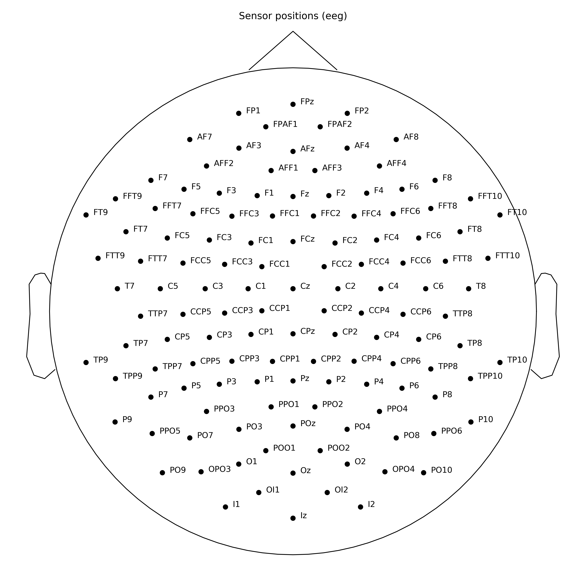

# TruScanEEGpy

[](https://pypi.python.org/pypi/TruScanEEGpy)
[](https://travis-ci.org/neuropsychology/TruScanEEGpy)
[](https://codecov.io/gh/neuropsychology/TruScanEEGpy)
[](https://truscaneegpy.readthedocs.io/en/latest/?badge=latest)

**Utilities to work with Deymed’s TruScan EEG system.**

## Installation

To install TruScanEEGpy, run this command in your terminal:

    pip install https://github.com/neuropsychology/TruScanEEGpy/zipball/master

## Documentation

``` python
import TruScanEEGpy
import mne

layout = TruScanEEGpy.layout_128('10-5')
montage = TruScanEEGpy.montage_mne_128(layout)
mne.viz.plot_montage(montage)
```

<!-- -->
